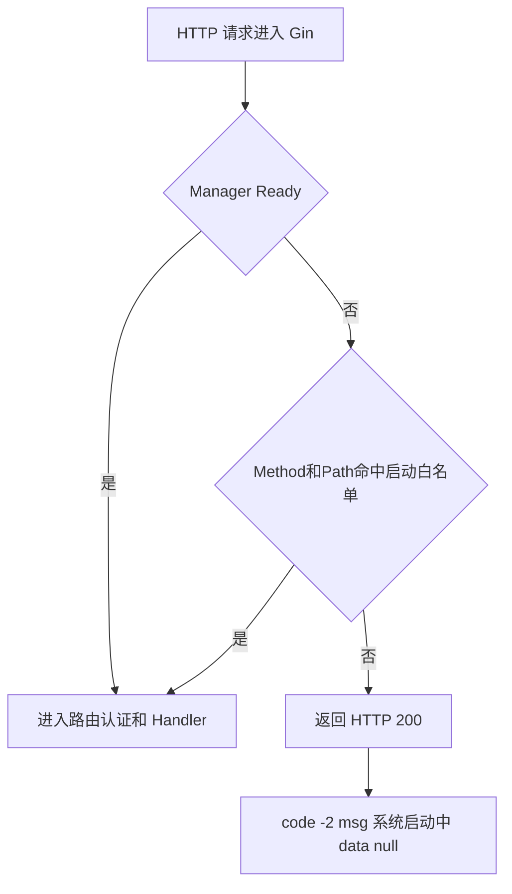
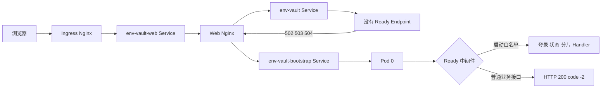
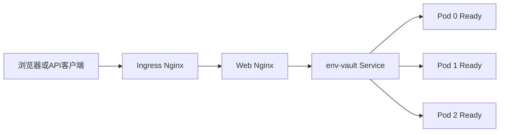
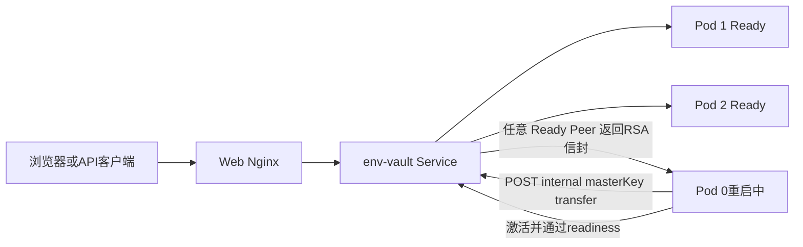
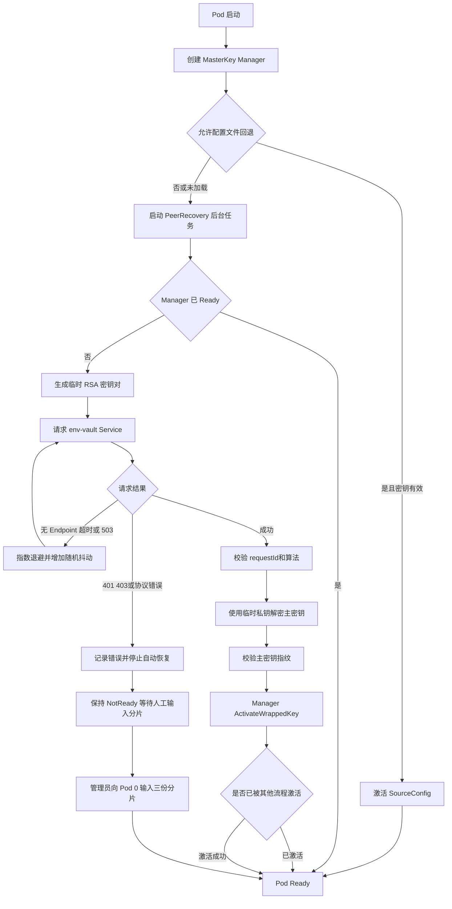
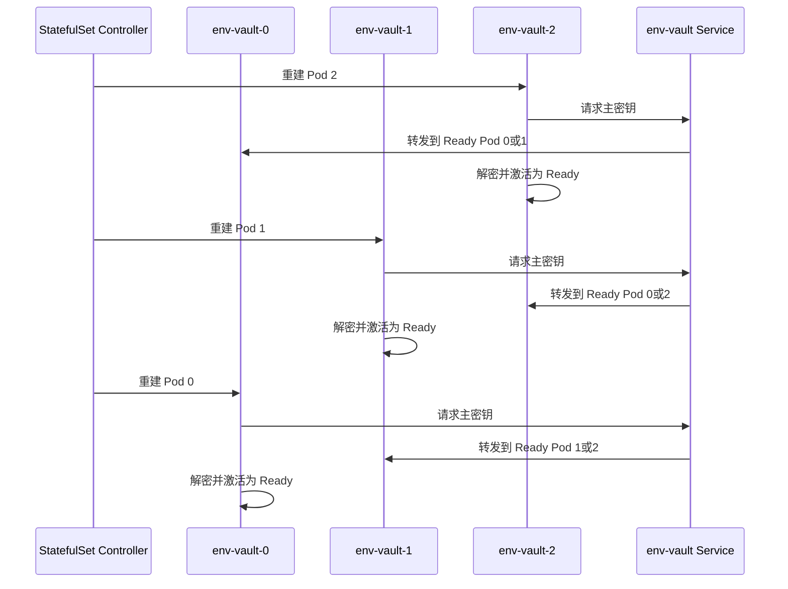

# 主密钥加载设计

> 状态：人工分片恢复、Peer 传输服务端和 Peer 自动恢复客户端已实现
>
> 最后更新：2026-09-03

## 1. 目标

- 使用 AES-256-GCM 主密钥加密 Secret，主密钥不持久化到数据库或 Redis
- 使用 3-of-5 Shamir 分片恢复主密钥，任意三份同批次分片均可恢复
- 开发环境可通过显式开关从 `config.yaml` 回退加载主密钥
- 主密钥未激活时 HTTP 服务仍可启动，但普通业务接口不可访问
- 首次启动由管理员向 Pod 0 逐份提交分片
- 滚动重启时，新 Pod 从任意 Ready Pod 自动获取主密钥
- 所有 Pod 同时丢失内存状态时，重新通过三份分片恢复

## 2. 核心约束

### 2.1 单一状态源

系统是否可提供业务服务直接使用 `masterkey.Manager.Ready()` 判断，不维护第二份全局布尔状态。

`Manager` 统一提供以下能力：

- `Ready()`：查询主密钥是否已激活
- `Status()`：查询 Ready 状态和加载来源
- `Encrypt()`：使用当前主密钥加密
- `Decrypt()`：使用当前主密钥解密
- `Activate()`：通过配置或 Peer 主密钥激活
- `SubmitShare()`：逐份接收分片并在达到阈值后激活

主密钥来源包括：

| source | 含义 |
| --- | --- |
| `config` | 开发环境配置文件回退 |
| `shares` | 管理员提交 Shamir 分片恢复 |
| `peer` | 从其他 Ready Pod 获取 |

### 2.2 数据保存规则

- 主密钥只保存在进程内存
- 未达到阈值的分片只保存在 Pod 0 当前进程内存
- 分片、完整主密钥和临时 RSA 私钥不写数据库、Redis、日志或审计详情
- 主密钥激活后禁止在线替换
- 在线轮换主密钥不属于当前方案

### 2.3 正确性边界

首次安装时，三个合法、同批次且不重复的分片恢复出的 32 字节密钥即为系统主密钥，不通过解密数据库 Secret 做额外校验。

Peer 传输时校验 RSA-OAEP-SHA256 算法、请求 ID 和 SHA-256 密钥指纹。指纹用于验证传输完整性，不替代 Peer 身份认证。

### 2.4 组件职责

| 组件 | 职责 | 主密钥未就绪时的行为 |
| --- | --- | --- |
| Vue 应用 | 登录、启动等待、分片输入、路由守卫和业务页面 | 通过状态接口进入等待页，收到 `code=-2` 时保存原地址并跳转 |
| Web Nginx | 提供前端静态文件并代理所有 `/api/**` | 普通 Service 返回 502、503、504时回退 bootstrap Service |
| Ingress Nginx | 对外暴露 `/envvault/**` 并转发到 Web Nginx | 不直接暴露 bootstrap Service |
| `env-vault-web` Service | 将入口流量转发给 Web Nginx | 始终可用，不依赖后端主密钥状态 |
| `env-vault` Service | 承载普通业务流量和 Peer 自动恢复 | 只包含 `Manager.Ready()` 为 true且 readiness 通过的 Pod |
| `env-vault-bootstrap` Service | 通过稳定 ClusterIP 为首次启动提供固定入口 | 只选择未 Ready 的 Pod 0，仅由 Web Nginx 回退访问 |
| Ready 中间件 | 使用 `Manager.Ready()` 控制 Go 路由 | 放行白名单，其他请求返回 HTTP 200和 `code=-2` |
| JWT 中间件 | 校验登录用户、锁定状态和 PAT | 启动白名单只跳过 Ready 限制，不跳过该接口自身的认证要求 |
| MasterKey Handler | 提供状态、分片、内部 readiness 和 Peer 传输接口 | 按接口契约返回安全状态，不输出主密钥或分片 |
| PeerRecovery | 新 Pod 从任意 Ready Pod 获取加密后的主密钥 | 无 Ready Endpoint 时退避重试，不使用 bootstrap Service |

## 3. 当前实施状态

| 能力 | 状态 | 当前实现 |
| --- | --- | --- |
| 并发安全的主密钥 Manager | 已完成 | `internal/masterkey/manager.go` |
| Secret 动态加解密接入 | 已完成 | Secret、个人 Secret、PAT 和环境复制逻辑复用 Manager |
| 开发配置回退 | 已完成 | `security.allow_config_key_fallback` 显式控制 |
| 3-of-5 Shamir 拆分与恢复 | 已完成 | 使用 HashiCorp Shamir 实现 |
| 离线生成及拆分工具 | 已完成 | `cmd/masterkey` 支持 `generate` 和 `split` |
| 单份分片累计 | 已完成 | 校验批次、编号、重复项、格式和完整性 |
| 登录后提交分片 | 已完成 | 状态和提交接口经过 JWT 认证 |
| Ready 全局拦截 | 已完成 | 未就绪时普通接口返回 `code=-2` |
| 启动接口白名单 | 已完成 | 按 HTTP Method 和精确 Path 配置 |
| 分片提交审计 | 已完成 | 不记录分片、主密钥和恢复材料 |
| 登录接口限流 | 已完成 | 按客户端 IP 和用户名限制 |
| 分片提交独立限流 | 待开发 | 请求体大小限制已完成，独立频率限制未实现 |
| 登录、等待和单份分片页面 | 已完成 | `env-vault-web` 已接入状态轮询和路由守卫 |
| Kubernetes bootstrap Service | 已完成 | 只选择 Pod 0，并允许未 Ready 时访问 |
| 主密钥 readinessProbe | 已完成 | Manager Ready 后才进入普通 Service |
| Peer RSA 包装与解包 | 已完成 | 临时公钥包装、指纹校验和 `SourcePeer` 激活 |
| Peer 内部传输接口 | 已完成 | `POST /internal/v1/masterKey/transfer` |
| Peer 自动发现与恢复客户端 | 已完成 | 通过普通 `env-vault` Service 获取任意 Ready Peer 的主密钥 |
| Peer mTLS 身份认证 | 待开发 | 当前临时使用独立内部令牌 |
| 全部 Pod 同时重启后的自动恢复 | 不实现 | 没有存活 Peer 时必须重新输入三份分片 |

## 4. 分片与认证流程

### 4.1 分片格式

分片 Token 使用 `EVS1.<Base64URL(JSON)>` 格式，内容包含：

- `keySetId`：一次 Shamir 拆分产生的分片批次 UUID
- `index`：分片唯一编号
- `data`：Base64 编码的原始分片
- `checksum`：Token 版本和内容的 SHA-256 校验值

`keySetId` 与 Secret 历史记录的 `batchId` 没有关系。重新生成主密钥会使已有密文无法解密；仅对同一个主密钥重新拆分则不会改变已有密文。

### 4.2 外部接口与认证规则

```text
GET  /api/v1/pub/health            无需 JWT，只表示 HTTP 进程存活
POST /api/v1/pub/auth/login       无需 JWT，用于系统本地登录
GET  /api/v1/masterKey/status     需要 JWT，未就绪时允许访问
POST /api/v1/masterKey/share      需要 JWT，未就绪时允许访问
```

当前允许所有已登录且未锁定用户提交分片，不以不同 `userId` 证明分片由不同管理员持有。后续角色权限通过独立授权检查收紧，不改变分片接口结构。

`/pub/health` 用于 startupProbe 和 livenessProbe，返回成功只能证明 Go HTTP 进程存活，不能证明主密钥已经加载。Pod 是否可以接收业务流量必须以 `/internal/v1/masterKey/ready` 和 Kubernetes readiness 为准。

Ready 白名单只允许请求继续进入后续中间件。`status` 和 `share` 仍会经过 JWT、用户锁定检查和审计逻辑，未登录返回 HTTP 401，被锁定用户返回 HTTP 403。

### 4.3 查询主密钥状态

```http
GET /api/v1/masterKey/status
Authorization: Bearer <JWT或PAT>
```

未就绪示例：

```json
{
  "code": 0,
  "msg": "success",
  "data": {
    "ready": false,
    "source": "",
    "totalShares": 5,
    "requiredShares": 3,
    "submittedShares": 1,
    "canSubmit": true
  }
}
```

已就绪时 `ready=true`、`canSubmit=false`、`submittedShares=0`，`source` 为 `config`、`shares` 或 `peer`。该接口只返回运行状态，不返回分片批次、分片内容、主密钥或主密钥指纹。

| 情况 | HTTP | body.code | 处理 |
| --- | --- | --- | --- |
| 查询成功 | 200 | `0` | 返回同一读锁下取得的状态快照 |
| JWT 缺失或失效 | 401 | `401` | 认证中间件终止请求 |
| 用户被锁定 | 403 | `403` | 认证中间件终止请求 |
| 审计写入失败 | 200 | `-1` | 返回 `internal error`，不返回未审计的状态结果 |

### 4.4 提交单份主密钥分片

```http
POST /api/v1/masterKey/share
Authorization: Bearer <JWT或PAT>
Content-Type: application/json

{
  "share": "EVS1.<分片内容>"
}
```

未达到阈值时返回累计后的状态；第三份合法分片恢复成功时返回 `ready=true` 和 `source=shares`。请求体最大为 16 KiB，服务端在完成处理后主动解除对请求分片字符串的引用。

| 情况 | HTTP | body.code | 对外提示和状态处理 |
| --- | --- | --- | --- |
| 接受合法分片但未达到阈值 | 200 | `0` | `submittedShares` 增加，继续等待 |
| 第三份合法分片恢复成功 | 200 | `0` | 原子激活 Manager，清空暂存分片 |
| JSON 非法、请求体过大或分片为空 | 200 | `-1` | 拒绝请求，不改变已累计状态 |
| 分片格式或校验值无效 | 200 | `-1` | 返回“密钥分片无效” |
| 分片批次不一致 | 200 | `-1` | 返回“密钥分片不属于同一批次” |
| 重复提交同一编号 | 200 | `-1` | 返回“密钥分片重复” |
| Manager 已经激活 | 200 | `-1` | 返回“系统主密钥已经激活” |
| JWT 缺失或失效 | 401 | `401` | 认证中间件终止请求 |
| 用户被锁定 | 403 | `403` | 认证中间件终止请求 |
| 审计写入失败 | 200 | `-1` | 回滚本次内存状态变化并返回 `internal error` |

分片提交审计只记录 Ready、来源、已提交数量和阈值，不记录请求体、分片、主密钥、指纹或派生材料。

### 4.5 逐份提交规则

1. 第一份合法分片确定当前恢复过程的 `keySetId`
2. 后续分片必须属于同一 `keySetId`
3. 相同分片编号不得重复提交
4. 同一用户可以提交多份不同分片
5. 达到三份后立即组合并原子激活主密钥
6. 激活成功后清除所有暂存分片并拒绝继续提交
7. 审计写入失败时回滚本次内存状态变化

## 5. Ready 拦截

Ready 中间件注册在 Gin 根路由，执行顺序早于具体路由和 JWT 认证：

- `Ready=true`：正常放行业务接口
- `Ready=false` 且命中白名单：只跳过 Ready 限制，继续执行接口自身的 JWT 或内部令牌认证
- `Ready=false` 且未命中白名单：不进入业务 Handler，返回 HTTP 200和业务码 `-2`
- 普通接口未就绪响应使用 HTTP 200



```json
{
  "code": -2,
  "msg": "系统启动中",
  "data": null
}
```

`-2` 是 EnvVault 定义的系统启动状态码，语义固定为“当前实例尚未加载主密钥，因此普通业务能力不可用”。它不是通用失败码，也不等同于 HTTP 503。

| 表现 | 产生位置 | 含义 | 客户端处理 |
| --- | --- | --- | --- |
| HTTP 200，`code=0` | 业务 Handler | 请求成功 | 正常读取 `data` |
| HTTP 200，`code=-2` | Ready 中间件 | 请求已到达 Go Pod，但主密钥未就绪 | 前端保留当前地址并跳转 `/masterKey` |
| HTTP 200，`code=-1` | Handler 或应用服务 | 已进入业务逻辑但处理失败 | 展示 `msg` |
| HTTP 401或403 | 认证中间件 | 未登录、令牌失效或用户被锁定 | 进入登录或禁止访问流程 |
| HTTP 502、503、504且没有统一 envelope | Ingress、Web Nginx、Service 或内部 readiness | 请求没有成功进入可处理该请求的业务 Handler | Web Nginx先尝试 bootstrap 回退，仍失败时按传输错误处理 |

前端不得把任意 HTTP 503解释为“主密钥未加载”。只有统一响应体中的 `code=-2` 具有启动跳转语义。

当前白名单至少包含：

```yaml
security:
  ready_allowlist:
    - method: GET
      path: /api/v1/pub/health
    - method: POST
      path: /api/v1/pub/auth/login
    - method: GET
      path: /api/v1/masterKey/status
    - method: POST
      path: /api/v1/masterKey/share
    - method: GET
      path: /internal/v1/masterKey/ready
```

`/api/v1/masterKey/status` 和 `/api/v1/masterKey/share` 必须存在于白名单，否则系统未就绪时管理员无法查看状态或提交分片。`/internal/v1/masterKey/ready` 命中白名单后仍会检查内部令牌，并由 Handler 使用 HTTP 200或503表达 Pod readiness。

## 6. Kubernetes Service 职责

| Service | 选择范围 | 用途 |
| --- | --- | --- |
| `env-vault-web` | 选择 Web Nginx Pod | 所有外部页面和 API 的统一入口 |
| `env-vault-bootstrap` | 稳定 ClusterIP，固定选择 `env-vault-0`并包含未 Ready Pod | Web Nginx的 502、503、504回退，首次启动时承载登录、状态和分片请求 |
| `env-vault-headless` | 为每个 StatefulSet Pod 提供稳定 DNS | 保留 Pod 网络身份，不用于自动恢复请求 |
| `env-vault` | 只包含 Ready Pod | 普通业务流量和 Peer 自动恢复请求 |

外部 Ingress 不直接指向 `env-vault-bootstrap`。所有 API 先进入 Web Nginx，Web Nginx优先代理到 `env-vault`；只有普通 Service 无法建立可用连接时才将原请求回退到 bootstrap。

Web Nginx与 Pod 0之间不设置启动顺序依赖。bootstrap Service 的 ClusterIP 在 Pod 0重建和 Pod IP变化时保持稳定；Pod 0暂时不存在时，Web Nginx仍可提供静态等待页面，API回退在 Pod 0开始监听后自动恢复。`env-vault-headless` 只保留 StatefulSet 的固定网络身份，不参与 Web Nginx回退。

### 6.1 首次启动流量



首次启动时三台 Go Pod 均可运行，但都未进入普通 Service。登录、状态和分片请求经 Web Nginx回退到 Pod 0，确保所有未达到阈值的分片保存在同一进程。第三份合法分片激活 Pod 0后，其 readiness probe 成功，Pod 0加入普通 Service；Pod 1和 Pod 2随后通过 PeerRecovery 从普通 Service 中的 Pod 0获取主密钥。

### 6.2 正常业务流量



主密钥加载后，包括 `/api/v1/masterKey/status` 在内的所有外部 API 均使用普通 Service，由 Kubernetes 在 Ready Pod 间分发。此时 bootstrap Service 保留但不在正常请求链路中。

### 6.3 Pod 0重启流量



Pod 0退出后，Pod 1和 Pod 2继续响应状态与业务接口，因此前端路由守卫不会中断。新 Pod 0从普通 Service 中的任意 Ready Peer 恢复主密钥，不依赖 bootstrap Service。只有所有 Ready Pod 同时消失时，系统才重新进入人工分片恢复流程。

Peer 自动恢复不配置 Pod 地址列表，也不轮询 `env-vault-0/1/2`，统一访问：

```text
http://env-vault.env-vault.svc.cluster.local/internal/v1/masterKey/transfer
```

原因如下：

- `env-vault-bootstrap` 始终指向 Pod 0，Pod 0 重启时无法从 Pod 1 或 Pod 2 获取主密钥
- `env-vault-headless` 可能解析到多个具体 Pod，客户端需要自行维护 Ready 判断和副本列表
- 固定 Pod 地址列表会与扩缩容耦合
- `env-vault` 由 Kubernetes 自动维护 Ready Endpoint 并完成负载均衡

`env-vault-bootstrap` 和 `env-vault-headless` 仍然保留，只是不承担 Peer 自动恢复职责。前者解决首次启动没有 Ready Endpoint的问题，后者保留 StatefulSet 网络身份。

## 7. 已实现的 Peer 传输服务端

内部接口不使用用户 JWT，统一校验 `X-Env-Vault-Internal-Token`。该令牌来自 `security.master_key_peer_token`，只能通过运行时 Secret 注入，禁止放入 URL、镜像、日志或响应。

### 7.1 Pod readiness 接口

```http
GET /internal/v1/masterKey/ready
X-Env-Vault-Internal-Token: <内部令牌>
```

| 情况 | HTTP | body.code | 处理 |
| --- | --- | --- | --- |
| Manager 已激活 | 200 | `0` | 返回 `{"status":"ready"}`，readiness probe 成功 |
| Manager 未激活 | 503 | `503` | 返回“系统主密钥尚未激活”，Pod 不进入普通 Service |
| 服务端未配置内部令牌 | 503 | `503` | 主动禁用内部接口 |
| 内部令牌不匹配 | 401 | `401` | 常量时间比较失败并终止请求 |

该接口不返回来源、主密钥、分片、指纹或 Peer 信息。Kubernetes readiness probe 每秒调用一次，只有成功响应才将当前 Pod 加入 `env-vault` Service。

### 7.2 主密钥传输接口

```http
POST /internal/v1/masterKey/transfer
X-Env-Vault-Internal-Token: <内部令牌>
Content-Type: application/json
```

请求方生成临时 RSA 密钥对，只发送公钥：

```json
{
  "instanceId": "env-vault-1",
  "requestId": "本次请求的UUID",
  "publicKey": "Base64编码的临时RSA公钥",
  "algorithm": "RSA-OAEP-SHA256"
}
```

Ready Pod 返回使用临时公钥包装的主密钥信封：

```json
{
  "code": 0,
  "msg": "success",
  "data": {
    "requestId": "本次请求的UUID",
    "encryptedMasterKey": "Base64编码的RSA密文",
    "keyFingerprint": "sha256:...",
    "algorithm": "RSA-OAEP-SHA256"
  }
}
```

接口只通过普通 `env-vault` Service 调用，因此正常情况下请求只会到达已经 Ready 的 Peer。请求方临时 RSA 私钥只存在于请求方内存，服务端只能看到公钥。

| 情况 | HTTP | body.code | 处理 |
| --- | --- | --- | --- |
| 传输成功 | 200 | `0` | 返回 RSA-OAEP-SHA256 加密信封和完整性指纹 |
| 服务端未配置内部令牌 | 503 | `503` | 主动禁用内部传输能力 |
| 内部令牌不匹配 | 401 | `401` | 终止请求，不解析请求体 |
| 请求体非法、过大或公钥无效 | 200 | `-1` | 不导出主密钥并记录失败审计 |
| 算法不支持或请求标识过长 | 200 | `-1` | 拒绝协议不兼容请求 |
| 目标实例尚未 Ready | 200 | `-2` | 根 Ready 中间件在进入 Transfer Handler 前阻止请求 |
| 导出过程中发现 Manager 未 Ready | 503 | `503` | Handler 终止传输，不返回信封 |
| 审计写入失败 | 200 | `-1` | 不返回未审计的主密钥信封 |

成功审计只记录调用实例、Ready 状态和协议结果，不记录内部令牌、临时公钥、RSA 密文、主密钥、指纹或完整响应体。当前使用 HTTP 加 RSA 信封保护主密钥，后续使用 mTLS 替换共享令牌认证。

## 8. Peer 自动恢复客户端

### 8.1 配置设计

保留现有内部令牌配置，新增结构化的自动恢复配置：

```yaml
security:
  master_key_peer_token: ""
  master_key_peer_recovery:
    enabled: true
    base_url: "http://env-vault.env-vault.svc.cluster.local"
    request_timeout: 3s
    initial_retry_interval: 1s
    max_retry_interval: 15s
```

开发环境默认关闭自动恢复，Kubernetes 部署配置开启。内部固定路径由模块维护，不允许通过配置替换。

### 8.2 模块接口

所有自动恢复逻辑继续放在 `internal/masterkey` 模块，对调用方只暴露构造和运行接口：

```go
type PeerRecovery struct {
    // 内部状态
}

func NewPeerRecovery(manager *Manager, config PeerRecoveryConfig) (*PeerRecovery, error)

func (r *PeerRecovery) Run(ctx context.Context) error
```

`Run` 内部负责临时 RSA 密钥、HTTP 请求、响应大小限制、协议校验、主密钥激活和退避重试。Router 只负责组装和启动，不处理恢复细节。

### 8.3 完整启动流程



### 8.4 首次启动流程

1. StatefulSet 的 Pod 0、1、2 启动，但 Manager 均未激活
2. 普通 `env-vault` Service 没有 Ready Endpoint，三个 Pod 的自动恢复任务持续退避
3. 管理员提交的分片请求由 Web Nginx回退到 bootstrap Service，再向 Pod 0逐份提交三个分片
4. Pod 0 以 `source=shares` 激活并进入普通 Service
5. Pod 1、2 的下一次重试由普通 Service 转发到 Pod 0
6. Pod 1、2 解开主密钥信封，以 `source=peer` 激活并进入 Ready

### 8.5 滚动更新流程



Peer 恢复不依赖 Pod 0。只要普通 Service 中至少存在一个使用相同主密钥的 Ready Pod，重建中的 Pod 就可以恢复。

### 8.6 重试与错误处理

| 场景 | 处理方式 |
| --- | --- |
| DNS 暂不可用、连接失败、超时 | 指数退避后重试 |
| Service 没有 Ready Endpoint | 指数退避后重试 |
| HTTP 502、503、504 | 指数退避后重试 |
| HTTP 401、403 | 视为内部令牌配置错误，记录错误并停止自动恢复 |
| HTTP 400、404 | 视为配置或版本不兼容，记录错误并停止自动恢复 |
| 响应过大、JSON 非法 | 不激活，记录协议错误 |
| requestId或算法不一致 | 不激活，记录安全错误 |
| RSA 解密或指纹校验失败 | 不激活，记录安全错误 |
| 人工分片先完成激活 | 检测 Manager 已 Ready，按成功结束恢复任务 |
| 进程收到退出信号 | 取消 HTTP 请求和退避等待，结束恢复任务 |

日志禁止输出内部令牌、分片、主密钥、临时私钥、RSA 密文和请求响应正文。

非 debug 模式不记录 `/api/v1/pub/health` 和 `/internal/v1/masterKey/ready` 的访问日志，避免健康检查持续刷屏。debug 模式保留探针访问日志，其他业务接口在所有模式下均正常记录。

### 8.7 日志与运行验证

以下日志按照单个 Pod 输出：

| 日志 | 含义 |
| --- | --- |
| `server started` | HTTP 服务已经监听，不代表主密钥已经加载 |
| `master key peer recovery started` | 当前 Pod 已启动 Peer 自动恢复任务 |
| `master key peer recovery retrying` | 暂无可用 Ready Peer或出现可重试传输错误 |
| `master key recovered from peer` | 当前 Pod 已解密并激活从其他 Ready Pod取得的主密钥 |
| `/internal/v1/masterKey/ready` 返回 200 | 当前 Pod 的 Manager 已 Ready，readiness probe 可以将其加入普通 Service |

检查 Pod 1和 Pod 2是否已经自动恢复：

```bash
kubectl -n env-vault wait \
  --for=condition=Ready \
  pod/env-vault-1 pod/env-vault-2 \
  --timeout=120s

kubectl -n env-vault logs env-vault-1 --since=10m |
  grep -E 'server started|master key peer recovery started|master key recovered from peer'

kubectl -n env-vault logs env-vault-2 --since=10m |
  grep -E 'server started|master key peer recovery started|master key recovered from peer'
```

`Running` 只表示容器进程存在，不能单独证明主密钥已加载。高可用检查还必须确认 Pod 位于普通 Service 的 Ready EndpointSlice：

```bash
kubectl -n env-vault get endpointslice \
  -l kubernetes.io/service-name=env-vault \
  -o jsonpath='{range .items[*].endpoints[*]}{.targetRef.name}{"\tready="}{.conditions.ready}{"\t"}{.addresses[0]}{"\n"}{end}'
```

验证 Pod 0重启期间外部入口连续可用时，先循环请求健康接口，再在另一个终端删除 Pod 0。整个窗口不应出现 5xx，Pod 0恢复后应出现 `master key recovered from peer` 并重新加入 EndpointSlice。

```bash
while true; do
  printf '%s ' "$(date +%T)"
  curl -sS -o /dev/null -w '%{http_code}\n' \
    http://efficient-poc.qiuer.net:30080/envvault/api/v1/pub/health
  sleep 0.2
done
```

```bash
kubectl -n env-vault delete pod env-vault-0
kubectl -n env-vault get pods -w
```

### 8.8 实施文件

| 文件 | 调整内容 |
| --- | --- |
| `internal/masterkey/peer_recovery.go` | 新增自动恢复模块 |
| `internal/masterkey/peer_recovery_test.go` | 新增成功、重试、取消、认证失败、响应篡改和并发激活测试 |
| `internal/infrastructure/config/config.go` | 增加 `MasterKeyPeerRecoveryConfig` |
| `internal/infrastructure/config/config_test.go` | 验证新增配置和环境变量覆盖 |
| `configs/config.yaml` | 本地环境默认关闭自动恢复 |
| `internal/interfaces/router/router.go` | 组装并异步启动 PeerRecovery |
| `cmd/main.go` | 创建应用生命周期 Context，退出时取消恢复任务 |
| `deploy/k8s/env-vault-statefulset.yaml` | 开启恢复并配置普通 Service 地址 |
| `design/deploy.md` | 同步 Kubernetes 启动与滚动更新说明 |
| `README.md` | 补充配置和验证方式 |

现有 `keywrap.go`、`Manager.ActivateWrappedKey()` 和 `/internal/v1/masterKey/transfer` 直接复用，不重新实现密钥包装逻辑。不需要新增数据库表、外部接口或前端页面。

### 8.9 验收条件

1. 首次启动时三个 Pod 均未 Ready，向 Pod 0 输入三份分片后全部进入 Ready
2. Pod 0 状态来源为 `shares`，Pod 1、2 状态来源为 `peer`
3. 单独删除任意一个 Pod 后，该 Pod 不需要人工输入分片即可恢复
4. StatefulSet 按 2、1、0 滚动更新时，全程不需要重新输入分片
5. 三个 Pod 同时重建时自动恢复持续等待，向 Pod 0 输入三份分片后全部恢复
6. 内部令牌错误、响应篡改或算法不一致时，目标 Pod 不得进入 Ready
7. Pod 0重启期间健康接口和 `/masterKey/status` 可以由 Pod 1或 Pod 2响应，不出现 5xx
8. `go test ./...` 和 Kubernetes client/server dry-run 均通过

## 9. 已知限制与后续事项

- 主密钥只保存在内存，全集群同时退出后不能自动恢复
- 当前 Peer 身份使用共享内部令牌，后续替换为 mTLS 工作负载身份
- 分片提交接口还需要独立限流
- 当前不支持在线主密钥轮换
- 当前示例清单部署三个跨节点分散的 `env-vault-web` 副本，并通过探针和 PodDisruptionBudget 保留至少两个可用 Web Pod；Ingress Controller 的副本数和高可用仍由集群入口组件单独保障
- Web Nginx当前与 Vue静态资源打包在同一个前端镜像；未来需要独立扩容或发布时，可拆分 `env-vault-gateway`，由它接管 `/api/**` 的普通 Service代理和 bootstrap回退，前端 Web仅提供静态资源，Ingress分别将 API和页面路径转发到对应 Service
- 未来如需全集群断电后无人值守恢复，需要引入 KMS、HSM 或独立 Unseal 服务，并重新评估安全边界
