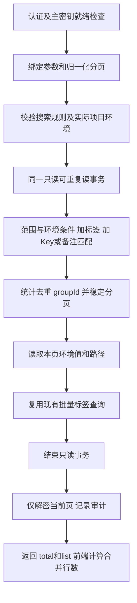

# 密钥搜索

## 当前能力

使用独立的 `internal/search` 模块实现 `POST /api/v1/secret/search`，支持 Key、备注和标签条件，不修改现有 Secret 增删改、list 与历史查询
前端沿用已经确认的合并表格，展示模型见前端仓库 `design/secret-search.md`

```json
{
  "scopes": [
    {
      "scopeType": "project",
      "scopeId": "8b85e3fa-c15a-480f-b4a2-000000000030"
    }
  ],
  "envList": ["dev", "prod"],
  "tagIdList": ["8b85e3fa-c15a-480f-b4a2-000000000050"],
  "keyword": "SERVICE",
  "pageNum": 1,
  "pageSize": 20
}
```

- scopes 支持 tenant、org、project、folder，folder 使用跨环境 folderGroupId，多个范围取并集
- 未指定范围时搜索全部当前允许查询的共享密钥，不包含个人密钥
- Key 或备注任一命中即可，不区分大小写，按完整输入做包含匹配，不分词、不做相似度匹配
- 用户输入的 `%`、`_`、`!` 作为普通字符转义，SQL 参数绑定，不允许输入 SQL 通配符扩大范围
- 同一项目的项目或目录范围必须提供 envList；跨项目或租户、组织范围不允许提供 envList
- 目录查询包含当前支持的一级目录及二级子目录，完整路径从 folder_info 父子关系构造，已删除祖先下的数据不可见
- 搜索全部范围、租户或组织时，关键词需包含至少 3 个连续的中文、字母或数字；短词或无法形成连续三字符的模式仅允许限定项目或目录查询，例如 `ab`、`密码`、`a_b`；中文按 Unicode 字符判断，不按字节数
- 空关键词表示范围内分页浏览，不添加文本匹配条件
- 每页默认 20 组，上限 200，复用 page.Request 和 page.Response；total 按 groupId 去重统计，响应只有 total 和 list
- tagIdList 缺省或空数组表示不筛选，最多 100 个并由后端去重；多标签匹配任意一个
- 范围之间取并集，标签与范围、环境、Key 或备注条件之间取交集；空关键词允许仅按标签分页查询
- 标签按 groupId 生效，不区分环境；响应仍返回密钥组绑定的全部有效标签，不只返回命中条件
- 已删除或不存在的标签返回失效错误，不能静默忽略筛选条件
- 历史在点击后加载，不随搜索响应预加载
- 项目或目录已删除、不存在时返回范围失效错误；租户或组织无有效内容时返回空列表

## 模块与现有代码接入

| 文件                                     | 职责                                                     |
| ---------------------------------------- | -------------------------------------------------------- |
| internal/search/types.go                 | 输入、固定展示模型、错误定义                             |
| internal/search/http.go                  | 受认证的 HTTP 入口和统一分页                             |
| internal/search/service.go               | 参数规则、超时、仅解密本页、只含安全元数据的审计         |
| internal/search/postgres.go              | 快照读取、范围与环境验证、组级分页和批量组装             |
| internal/search/query.go                 | 统一关联条件、范围和未来权限过滤                         |
| internal/interfaces/router/router.go     | 组装搜索模块并注册到现有 secret 路由                     |
| internal/infrastructure/config/config.go | 集中读取 search.query_timeout，默认 5s，可用环境变量覆盖 |

当前沿用共享密钥接口的认证边界，资源和环境授权仍待统一权限模型落地，不另建临时权限体系
当前通过认证的用户可查询共享密钥，`applyPermissionFilter` 是明确的待办，不应将本阶段表述为已实现资源授权
后续权限必须同时作用于标签候选、count、分页 groupId 与环境详情查询，过滤结果为空不能被解释为不限制

## 标签候选

`POST /api/v1/secret/search/tag/list` 根据当前范围和环境分页返回实际存在有效绑定的标签，供前端远程多选使用

- 请求包含 scopes、envList、keyword、pageNum、pageSize，范围和环境规则与密钥搜索一致
- keyword 对标签 name、code、remark 做不区分大小写的字面包含匹配，允许短关键词
- 只返回未删除、租户归属一致，并且在当前范围内至少绑定一个有效密钥组的标签
- 跨租户结果携带 tenantId 和 tenantName，同名或同 code 标签仍按 ID 区分
- 标签候选分页不读取密钥值，权限中心接入后复用搜索模块的统一权限过滤位置

## 查询流程



- 筛选与分页阶段只选择元数据，不选择或解密 value_ciphertext
- SQL 逻辑中范围、标签与关键词同时生效，由优化器决定扫描顺序，不强制先物化全库候选集
- 稳定排序为租户、组织、项目、目录组、Key、groupId，环境按 orderNo、code、secretId 排序
- 一个 Key 的命中环境不跨页，目录可跨页，每页重算合并行数
- 同一次请求 count、分页、路径、标签使用一致数据库快照，跨请求翻页不承诺搜索快照
- 获取本页详情时再次应用同一范围和环境条件，不能只凭 groupId 扩大返回范围
- 解密失败整次报错，不用空字符串伪造结果；空字符串只能表示真实空值
- 不缓存明文或全量结果，查询超时、失败与取消均不返回半页成功数据

## 索引与性能边界

DDL 见 `design/database.md` 的 Secret 搜索索引章节，由外部数据库变更执行，程序不自动创建索引
使用 pg_trgm 的 GIN 索引支持 key、remark 的 ILIKE 包含匹配，只索引 is_deleted=false 的记录
保留已有范围和 groupId 索引，不建立明文值索引

三元组索引只能改善可选择的查询，短词、高命中率、精确总数和深页码仍可能昂贵
短词限定项目或目录后仍可能超时，此时需要缩小范围或补充关键词，不改变包含匹配语义
现有 Key、备注在各环境重复保存，索引包含重复数据；先在真实规模测试，后续有证据再评估组级搜索投影表或游标分页

验收覆盖大小写、中文、字面量通配符、Key与备注 OR、父子范围重叠、不同范围同名 Key、空值、软删除祖先、环境隔离、组级分页、超时与取消
PostgreSQL 集成测试只连接显式提供的 `ENV_VAULT_SEARCH_TEST_DSN` 并使用独立 schema
性能测试使用虚构值，分别记录 count、分页、详情和标签耗时，以 EXPLAIN (ANALYZE, BUFFERS) 检查读取量，不要求优化器对所有输入都强制走索引

参考：[PostgreSQL pg_trgm](https://www.postgresql.org/docs/16/pgtrgm.html)、[组合索引](https://www.postgresql.org/docs/16/indexes-bitmap-scans.html)

## 验证与上线

```sh
# DSN 必须指向专用测试数据库，每次运行会创建并清理独立 schema
ENV_VAULT_SEARCH_TEST_DSN='host=127.0.0.1 port=5432 user=test_user dbname=search_test sslmode=disable' go test ./internal/search

# 显式生成 10 万和 100 万条虚构环境实例，执行真实 SQL 与 EXPLAIN
ENV_VAULT_SEARCH_TEST_DSN='host=127.0.0.1 port=5432 user=test_user dbname=search_test sslmode=disable' ENV_VAULT_SEARCH_PERF=1 go test ./internal/search -run TestPostgresSearchPerformance -count=1 -v
```

性能样例应先更新 Secret 与层级关联表的统计信息，过期的统计信息会导致不合适的连接顺序与索引选择
测试不关闭顺序扫描，也不强制优化器选索引，验收同时检查结果正确性和实际执行计划

### 本地性能样例

2026-09-15 使用独立的 PostgreSQL 15 Alpine 容器与 tmpfs 数据目录，虚构单项目、四环境数据，每页 20 组
以下为单次仓储查询观测值，包含范围校验、精确计数、组分页和本页详情，不包含 HTTP、审计、解密或真实标签读取，不代表生产延迟保证

| 环境实例行数 | 少量命中：1 组 | 中文三字：命中 1% 组 | 高频词：命中 99% 组      | 无匹配  |
| ------------ | -------------- | -------------------- | ------------------------ | ------- |
| 100,000      | 9.09 ms        | 8.90 ms / 250 组     | 118.53 ms / 24,750 组    | 1.33 ms |
| 1,000,000    | 9.21 ms        | 33.77 ms / 2,500 组  | 1,266.63 ms / 247,500 组 | 1.50 ms |

实际 Key OR 备注查询的执行计划已验证 BitmapOr 同时使用两个 GIN 索引
高频词与深分页仍需扫描、聚合或排序较多记录，默认 5s 超时用于限制单次查询，不应承诺有索引就一定快速
部署配置使用 PostgreSQL 16，正式上线仍需在目标版本和真实数据上验证，并补充并发、冷缓存、大值与大量环境测试

上线顺序：在应用数据库执行索引 DDL并检查有效性 → 更新统计信息 → 部署后端及前端 → 使用真实数据检查耗时与分页
query_timeout 仅在 search 模块生效，旧配置未新增该项时使用 5s，不要求同步修改所有部署配置
前端通过独立 `src/api/secret-search.ts` 调用新接口，切换条件取消旧请求并清空旧结果，页码/每页数量变化重新查询
页面只保存范围与环境，不保存关键词或返回明文；搜索结果默认展示明文值，支持点击复制和通过眼睛按钮手动隐藏
搜索页历史支持真实分页追加及按需批次加载，旧秘钥管理页暂不抽取公共组件，避免扩大第一步的改动范围

Java SDK 本阶段未增加搜索入口，也未改变 SDK 已使用的 secret/list 契约
